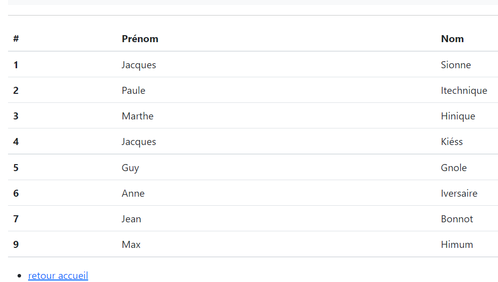
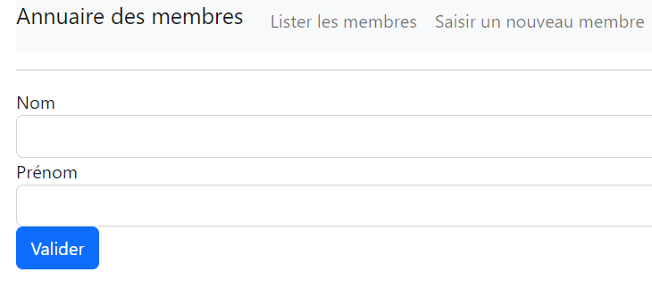

# 1 - Annuaire version étudiant
Un club de bridge a souhaité créer une application pour recencer tous ses membres. Un étudiant en informatique a durant son stage
créer un debut d'application.  
Les caractéristiques sont les suivantes :
1. Langage : PHP, HTML, CSS
2. Pattern :  MVC
3. Framework css : [Bootstrap](https://getbootstrap.com/docs/5.2/getting-started/introduction/)
Pour l'instant cette application est locale. 

## Etape 1 : Installation de l'application
1. Faire un clone du repository 
> git clone https://github.com/chchabin/annuaire-VerEtudt.git
2. Lancer le script `annuaire.sql`


## Etape 2 : Découverte de l'application
Lisez la partie 2 pour comprendre les principes du MVC.

## Etape 3 : Création de la fonctionalité liste membre
Ce qui vous est demandé de faire :
1. dans le fichier `m_model.php` trouvez la requête qui récupère tous les noms et prénom des membres.
2. Testez votre résultat.
   3. dans le fichier `v_listemembres.php` construisez un tableau HTML et remplissez les lignes dynamiquement à partir de la variable `$les_membres` qui envoyée par le contrôleur.
   La maquette de la vue `v_listemembres.php` doit avoir cette apparence :
     
      Fiches descriptives du cas d'utilisation à réaliser

| **PROJET :**   Application  web de afficher membre | **Description cas d’utilisation** |
|----------------------------------------------------|-----------------------------------|


| **Nom cas d’utilisation :**   Afficher les membres                                                                                                                                                                                       |
|------------------------------------------------------------------------------------------------------------------------------------------------------------------------------------------------------------------------------------------|
| **Acteur déclencheur :**   l’utilisateur                                                                                                                                                                                                 |
| **Scénario nominal :**  <p>1. L’utilisateur demande à afficher les membres. </p><p>2. Le système retourne le vue listemembres </p><p>3. L’utilisateur choisi de retourner à l’accueil. </p><p>4. Le système retourne la vue accueil </p> |
| <p>**Extensions :** </p> **Exceptions**                                                                                                                                                                                                  |
Gestion de l’action lister

1. Le système récupère les données de la requête getLesMembres
2. Le système affiche la vue listemembres
3. Les données des membres sont récupérées dans la vue.

## Etape 4 : Création de la fonctionalité saisir membre
Ce qui vous est demandé de faire :
1. dans le fichier `m_model.php` créez la fonction `insertMembre()` pour insérer un nouveau membre dans la base de données.
2. Créez un fichier `v_saisiemembre.php` et construisez un formulaire avec le nom et le prénom à saisir. La maquette de la vue doit avoir cette apparence :
3. Affichez le résultat de la saisie dans la vue `accueil.php`  
   Fiches descriptives du cas d'utilisation à réaliser

| **PROJET :**   Application  web de saisie membre | **Description cas d’utilisation** |
|--------------------------------------------------|-----------------------------------|


| **Nom cas d’utilisation :**   Saisir les membres                                                                                                                                                                                        |
|-----------------------------------------------------------------------------------------------------------------------------------------------------------------------------------------------------------------------------------------|
| **Acteur déclencheur :**   l’utilisateur                                                                                                                                                                                                |
| <p>**Scénario nominal :**  </p><p>1. L’utilisateur demande à saisir un membre. </p><p>2. Le système retourne le formulaire de saisie </p><p>3. L’utilisateur valide sa saisie. </p><p>4. Le système appel le contrôle de la saisie </p> |
| ><p>**Extensions :**</p>  **Exceptions**                                                                                                                                                                                                |


## Etape 5 : Création de la fonctionalité suprimer membre
Les membres seront supprimés un par un.
Ce qui vous est demandé de faire :
1. dans le fichier `m_model.php` créez la fonction `insertMembre()`
2. créez un fichier `v_deletemembre.php` dans lequel l'utilisateur chois le membre à supprimer dans une liste, puis valide la suppression
3.  Affichez le résultat de la saisie dans la vue `accueil.php`  
    Fiches descriptives du cas d'utilisation à réaliser.

| **PROJET :**   Application  web de supprimer membre | **Description cas d’utilisation** |
|-----------------------------------------------------|-----------------------------------|


| **Nom cas d’utilisation :**   Saisir les membres                                                                                                                                                                                                               |
|----------------------------------------------------------------------------------------------------------------------------------------------------------------------------------------------------------------------------------------------------------------|
| **Acteur déclencheur :**   l’utilisateur                                                                                                                                                                                                                       |
| <p>**Scénario nominal :**  </p><p>1. L’utilisateur demande à supprimer un membre. </p><p>2. Le système retourne le formulaire de saisie </p><p>3. L’utilisateur choisi le membre et valide sa saisie. </p><p>4. Le système appel le contrôle de la saisie </p> |
| ><p>**Extensions :**</p>  **Exceptions**                                                                                                                                                                                                                       |
# 2- Quelques explications

## a - Point d'entrée unique
Le fichier `index.php` va lire toutes les url lancées par l'utilisateur.  
Il faut distinguer 2 cas :
1. l'application se lance pour le **première fois**, dans ce cas les paramètres de l'url sont fixées par avance
2. l'utilisateur clique sur un lien du menu, l'url obtenu sera de la forme
>adresse du site/index.php?uc=nomcontroleur&action=nomaction

Par exemple vous pouvez avoir l'URL suivante si vous cliquez sur `Lister les membres` 
> http://localhost/annuaire-VerEtudt/index.php?uc=gerer&action=lister
## La gestion de l'url
Le fichier index.php va orienter le flux vers le contrôleur qui généralement est le fichier
>c_gerer.php  

Dans le contrôleur, le programme exécutera la fonction correspondant au nom de l'action. Ici l'action est appelée via un `switch`

## b - L'écriture de l'action dans le contrôleur
L'action va obtenir des données du modèle. Elle va les traiter et les envoyer à une vue. Voici un exemple
```php
        $les_membres=$pdo->getLesMembres(); // Appel de la fonction dans le modèle
        require 'views/v_listemembres.php'; // Appel de la vue à afficher
```
## c - Le modèle
Le modèle enregistre toutes les données, qu'elles viennent d'une base de données ou d'un tableau.  
Dans le cas d'une base de donnée elle rassemblera toutes les requêtes nécessaires à la fourniture de données.
Dans notre cas c'est la fonction `getLesMembres()` qui est appelée :
```php
    public function getLesMembres()
    {
        $sql = ''; // Requête à créer
        $req = PdoBridge::$monPdo->prepare($sql);
        $req->execute();
        $d = $req->fetchALL(PDO::FETCH_ASSOC);
        return $d;
    }
```
## d - La vue
Elle reçoit les données et le met en forme selon les besoins du client.
Ici c'est la vue `v_accueil` qui est appelée. Ele récupère les données de la variable `$message`
```php
<div class="p-5 mb-4 bg-light rounded-3">
    <div class="container-fluid py-5">
        <h1 class="display-5 fw-bold">Bienvenue</h1>
        <p><?php echo $message; ?></p>
    </div>
</div>
```
>**ATTENTION**  
> Ici le nom de la variable doit être identique dans l'action et dans la vue !